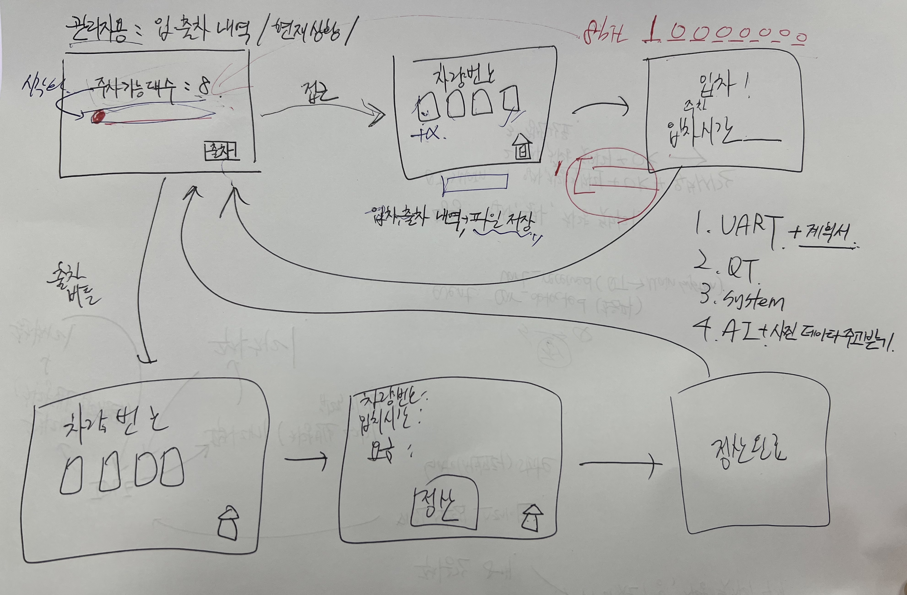

# Qt 미니프로젝트 설계서(주차타워 관제시스템)

## 목차

- [주요 기능](#주요-기능)
- [하드웨어 구성(파트리스트/핀맵/회로도)](#하드웨어-구성-파트리스트-핀-맵-회로도)
- [세부 구현 목록](#세부-구현-목록)
- [UI 구현 예상도](#ui-구현-예상도)
- [시나리오(입차/만차/출차)](#시나리오-0-시스템-시작-시-초기-동기화)
- [하드웨어 소프트웨어 역할 분담](#하드웨어-및-소프트웨어-역할-분담)
- [UART 통신 프로토콜](#uart-통신-프로토콜)
- [소프트웨어 상세 설계](#소프트웨어-상세-설계)

 
# 주요 기능

| **구분** | **담당 영역** | **주요 역할** |
| --- | --- | --- |
| **STM32 (Firmware)** | 물리 제어 및 센싱 | • 초음파 센서 거리 측정 및 차량 접근/통과 감지
|     |     | • 주차 공간 슬롯 점유 관리 (1~8번 비트/배열)
|     |     | • 최하층 주차면 자동 배정 알고리즘 수행
|     |     | • 서보모터(차단기) 개폐 및 자동 복귀 제어
|     |     | • 층별 점유 LED 8개 점등/소등 제어 |
| **Qt (GUI & Data)** | UI 및 데이터/비즈니스 로직 | • 사용자 입력 처리 (차량번호 4자리 입력, 입차/출차/정산 요청)
|     |     | • 입·출차 상태 및 만차 여부 화면 표시
|     |     | • 차량 정보 관리 (차량번호, 배정 층, 입차 시각, 정산 상태)
|     |     | • 주차 시간 및 주차 요금 계산 로직 처리 |


<br>
<br>
<br>

# 하드웨어 구성 (파트리스트 /핀 맵/ 회로도)

## 1. 사용 부품

| No. | 부품명 | 부품번호 | 개수 |
| --- | --- | --- | --- |
| 1 | STM32 M4 | NUCLEO-F411RE | 1 |
| 2 | 서보 모터 | SG90 | 1 |
| 3 | 초음파 센서 | HC-SR04 | 1 |
| 4 | LED |  | 8 |
| 5 | 330Ω 저항 |  | 8 |

## 2. 핀 맵

| **구분** | **부품 / 기능** | **STM32 핀 번호** | **설정모드** | **역할** |
| --- | --- | --- | --- | --- |
| **서보모터** | PWM | **PA0** | TIM2_CH1 | 차단기(차단봉) 제어 (50Hz PWM) |
| **초음파센서** | Trig | **PB4** | GPIO Output | 10µs 거리 측정 트리거 신호 |
|  | Echo | **PB6** | GPIO Input | 신호 반사 수신 (**5V Tolerant**) |
| **LED 8개** | LED 1~8 | **PC0 ~ PC7** | GPIO Output | 8개 주차 공간 점유 상태 표시 |


<br>
<br>
<br>

## 3. 하드웨어 회로도
[PDF 문서 열기](./image/qt_design.pdf)

<br>
<br>
<br>

# 세부 구현 목록

## STM32 M4

- 시스템은 1층부터 8층까지 총 8개의 주차 공간을 관리한다.
    - 각 층의 주차 공간 점유 상태를 LED 8개를 이용하여 표시한다.
- 차량이 설정 거리 이내로 접근하면 초음파 센서를 이용하여 차량의 접근을 감지한다.
    - 차량 접근이 감지되면 STM32는 현재 빈 주차 공간의 존재 여부를 확인한다.
    - STM32로부터 빈 주차 공간이 존재함을 확인한 경우 Qt는 차량번호 입력(xxx가xxxx) 및 입차 요청 기능을 활성화한다.
    - 입차 요청을 받으면 STM32는 빈 주차 공간 중 가장 낮은 층을 자동으로 배정한다.
    - 주차 공간 배정이 완료되면 서보 모터를 동작 시켜 차단기를 개방한다.
- 차단기는 개방 후 일정 시간이 지나면 자동으로 닫히면 배정된 층의 LED를 점등한다.
- 만차 상태에서는 차단기를 닫힌 상태로 유지한다.

## QT

- 사용자는 입차 시 Qt UI에 차량번호(xxx가xxxx) 8자리를 입력하고 입차를 요청한다.
    - Qt는 입차가 완료된 차량의 차량번호, 배정된 주차 층 및 입차 시간을 저장한다.

- 출차 시 사용자는 Qt UI에 차량번호(xxx가xxxx) 8자리를 입력하고 출차를 요청한다.
    - Qt는 입력된 차량번호를 검색하여 해당 차량의 주차 층 및 입차 정보를 확인한다.
    - Qt는 저장된 입차 시간과 현재 시간을 이용하여 총 주차 시간을 계산한다.
    - Qt는 총 주차 시간을 기반으로 주차 요금을 계산하여 사용자에게 표시한다.
    - 사용자가 정산 버튼을 누르면 해당 차량의 정산을 완료 상태로 처리한다.
    - 정산이 완료되면 서보 모터를 동작시켜 차단기를 개방한다.
    - 출차가 완료되면 해당 차량이 주차되어 있던 층의 LED를 소등한다.
- STM32로부터 만차 상태를 확인한 경우 Qt는 만차 상태를 표시하고 차량번호 입력 및 입차 요청 기능을 비활성화한다.
- 출차가 완료되면 Qt는 해당 차량의 주차 정보를 삭제 또는 출차 완료 상태로 처리하고,  STM32는 해당 주차 슬롯을 비어있음 상태로 변경한다.
- STM32와 Qt는 UART Serial 통신을 이용하여 주차 상태와 입·출차 관련 명령 및 처리 결과를 교환한다.


# UI 구현 예상도



# 하드웨어 및 소프트웨어 역할 분담
```c
┌────────────────────────────────────────┐       UART Serial       ┌────────────────────────────────────────┐
│             STM32 (MCU)                │ ◄─────────────────────► │                Qt (PC)                 │
│         [하드웨어 & 슬롯 제어]            │      (115200 bps)       │         [비즈니스 로직 & 관제]            │
├────────────────────────────────────────┤                         ├────────────────────────────────────────┤
│ • 초음파 센서 차량 감지 (거리 측정)        │                         │ • 차량번호 입력 및 유효성 검증             │
│ • 8개 주차 슬롯 EMPTY/OCCUPIED 관리      │                         │ • 차량번호 ↔ 배정 층 매핑 DB 저장          │
│ • 최저 빈 슬롯 자동 탐색 및 배정           │                         │ • 입차/출차 시간 기록                    │
│ • 만차(Full) 상태 자체 판단               │                         │ • 총 주차 시간 및 요금 자동 계산          │
│ • 서보모터 차단기 자동 개폐 제어           │                          │ • 사용자 정산 처리 및 입출차 이력 관리      │
│ • 8개 LED 점등/소등 (물리 상태 동기화)     │                          │ • 주차장 UI 뷰 렌더링                    │
└────────────────────────────────────────┘                         └────────────────────────────────────────┘
```


# UART 통신 프로토콜
- 종단 문자(EOL): `\r\n` (CR+LF)
- 문자 인코딩: ASCII
- 데이터/패리티/정지비트: `8-N-1`
- 통신 속도: `115200 bps`


### Qt → STM32 (명령 전송)

| 명령어 | 매개변수 | 설명 | 예시 |
| --- | --- | --- | --- |
| `?` | 없음 | 현재 8개 슬롯 점유 상태(8bit) 조회 | `?\r\n` |
| `I:<car4>` | `<car4>` (차량번호 뒤 4자리) | 입차 요청 (STM32가 최저 빈 슬롯 배정 및 차단기 개방) | `I:1234\r\n` |
| `O:<floor>` | `<floor>` (1~8) | 정산 완료/출차 요청 (해당 층 비움 처리 및 차단기 개방) | `O:3\r\n` |

### STM32 → Qt (이벤트 및 응답 전송)


| 명령어 | 매개변수 | 설명 | 예시 |
| --- | --- | --- | --- |
| `R` | 없음 | 부팅 완료 + 슬롯 상태 로드 완료 + UART 준비 완료(Ready) | `R\r\n` |
| `D` | 없음 | 입구 초음파 센서에 차량 접근 감지됨 | `D\r\n` |
| `S:<8bit>` | `<8bit>` (8자리 2진수) | 1~8층 점유 비트마스크 (`1`: 점유, `0`: 비어있음, Bit0=1층) | `S:00000101\r\n` |
| `P:<floor>` | `<floor>` (1~8) | 입차 성공: 배정된 최저 층 번호 응답 (LED 점등, 차단기 개방 포함) | `P:1\r\n` |
| `E` | 없음 | 출차 처리 완료: 해당 층 비움 처리 완료 (LED 소등, 차단기 개방 포함) | `E\r\n` |
| `E:<code>` | `<code>` | 잘못된 요청/상태 등의 에러 코드 | `E:2\r\n` |

## 프로토콜 명령어 총괄표

## 상세 패킷 규격 정의

<aside>

### 1.  `S:<8bit>`(STM32 → Qt)

- **데이터 포맷:** 8자리 2진 문자열 (`Bit7 Bit6 Bit5 Bit4 Bit3 Bit2 Bit1 Bit0` = 8층 ~ 1층)
    - 예: `S:00000011` → 1층, 2층 주차 중 / 3~8층 빈자리.
- **발생 조건:** Qt 프로그램 초기 실행 시점 또는 상태 동기화가 필요할 때.
</aside>

<aside>

### 2. `I` (Qt → STM32) & `P:<floor>` (STM32 → Qt)

- **만차 상태 시:** 차량 접근 시 만차 정보 표시
- **Qt 처리:** Qt UI의 차량번호 입력창과 [입차] 버튼을 활성화(Enable)하고 안내 메시지를 띄움.
- **발생 조건:** 차량이 초음파 센서 설정 거리(예: 10cm 이내)로 접근했을 때 STM32가 1회 발행.
</aside>

<aside>

### 3. `I:<car4>` (Qt → STM32) & `P:<floor>` (STM32 → Qt)

- **동작 흐름:**
    1. Qt가 `I:<car4>` 송신.
    2. STM32는 1~8번 슬롯 중 가장 낮은 빈 슬롯(예: 2층)을 탐색.
        - **빈 슬롯 존재 시:** 해당 슬롯을 `OCCUPIED`로 변경 → 해당 LED 점등 → 차단기 개방 → `P:2` 송신.
        - **만차 시:** `F` 송신.
    3. Qt는 `P:2`를 받으면 입력된 차량번호와 2층 매핑 정보 및 현재 입차 시간을 DB에 기록.
- **발생 조건:** 사용자가 Qt에 차량번호 4자리를 입력하고 [입차] 버튼을 눌렀을 때.
</aside>

<aside>

### 4. `O:<floor>` (Qt→ STM32) & `E:<floor>` (STM32 → Qt)

- **동작 흐름:**
    1. Qt가 자체 DB에서 해당 차량이 주차된 층(예: 3층)을 찾아 `O:3` 송신.
    2. STM32는 3번 슬롯을 `EMPTY`로 변경 → 3층 LED 소등 → 차단기 개방 → `E:3` 송신.
    3. Qt는 `E:3`를 수신한 후 DB에서 해당 차량의 주차 상태를 출차 완료로 갱신.
- **발생 조건:** 사용자가 차량번호를 조회해 요금을 정산하고 [출차/정산 완료]를 눌렀을 때.
- **에러 코드 체계**
    - `E:1` : 잘못된 파라미터 / 유효 범위 초과 (예: 1~8층 외 번호)
    - `E:2` : 상태 에러 (예: 이미 비어있는 층에 대한 출차 시도)
    - `E:3` : 만차 에러 (빈 슬롯 없음)
    - `E:0` : 정의되지 않은 알 수 없는 명령 수신
</aside>

### 시나리오 0. 시스템 시작 시 초기 동기화

```
[Qt 관제 UI]                      [STM32]
     │                              │
     ├─ 프로그램 시작 시 상태 질의 ──>│
     ├──────── ? ──────────────────>│
     │                              ├─ 현재 8개 핀 상태 읽기
     │<─────── S:00000011 ──────────┤ (1층, 2층 점유 중)
     ├─ 1, 2층 레드 / 3~8층 그린 갱신 │
```

### 시나리오 1. 정상 입차 프로세스 (1층 배정)

```c
[하드웨어/차량]            [STM32]                           [Qt 관제 UI]
      │                       │                                   │
      ├─ 초음파 센서 감지 ───>│                                     │
      │                       ├────────────────── D ─────────────>│
      │                       │                                   ├─ 차량번호 입력창 활성화
      │                       │                                    ├─ "1234" 입력 후 [입차] 클릭
      │                       │<────────────── I:1234 ─────────────┤
      │                       ├─ 최저 빈 층(1층) 탐색 & 점유 설정    │
      │                       ├─ 1층 LED(PC0) ON                   │
      │                       ├─ 서보모터 차단기 개방                │
      │                       ├────────────── P:1 ────────────────>│
      │                       │                                    ├─ DB 저장: [1234 - 1층 - 14:00:00]
      │                       │<delay 3s>                          │
      │                       ├─ 서보모터 차단기 자동 닫힘           │
```

### 시나리오 2. 만차 시 입차 요청 프로세스

```
[하드웨어/차량]            [STM32]                   [Qt 관제 UI]
      │                       │                           │
      ├─ 초음파 센서 감지 ───>│                             │
      │                       ├──────────────── D ───────>│
      │                       │<──────── F ───────────────┤
      │                       ├                           │
      │                       ├─ (차단기 닫힘 유지)         │
      │                       ├                            │
      │                       │                            ├─ "현재 만차입니다" 팝업 표시
```

### 시나리오 3. 정산 및 출차 프로세스 (1층 1234 차량 출차)

```
[사용자]                    [Qt 관제 UI]                           [STM32]
   │                             │                                    │
   ├─ "1234" 차량번호 조회 ─────>│                                      │
   │                             ├─ 1층 주차 확인 / 주차시간 계산        │
   │                             ├─ 요금 2,000원 화면 표시              │
   ├─ [정산 완료] 버튼 클릭 ────>│                                      │
   │                             ├────────── O:1 ───────────────────>│
   │                             │                                    ├─ 1층 슬롯 비움(EMPTY)
   │                             │                                    ├─ 1층 LED(PC0) OFF
   │                             │                                    ├─ 서보모터 차단기 개방
   │                             │<────────── E:1 ──────────────────┤
   │                             ├─ DB 1234 주차 이력 완료 처리       │
   │                             │                                    │<delay 3s>
   │                             │                                    ├─ 서보모터 차단기 자동 닫힘
```

## 상황별 통신 흐름 시나리오 및 예시 데이터

```c
// 0. 부팅/초기 동기화
STM -> Qt : R\r\n
STM -> Qt : S:00000011\r\n

// 1. 차량 접근 및 1층 입차
STM -> Qt : D\r\n
Qt  -> STM : I:1234\r\n
STM -> Qt : P:1\r\n

// 2. 만차 시 입차 시도
STM -> Qt : D\r\n
Qt  -> STM : I:1234\r\n
STM -> Qt : F\r\n

// 3. 1층 차량 요금 정산 후 출차
Qt  -> STM : O:1\r\n
STM -> Qt : E:1\r\n

// 4. 수동 상태 동기화 요청
Qt  -> STM : ?\r\n
STM -> Qt : S:00000000\r\n
```

```c
Qt → STM
P
E:<floor>
?

STM → Qt
D
P:<floor>
E:<floor>
S:<8bit>
```


# 소프트웨어 상세 설계

## 시스템 역할 및 책임 

### [프로젝트 디렉토리 구조 및 책임]

```
hardware/
├── header/
│   ├── main.h             // 시스템 전역 설정, 핀 정의, 기본 헤더
│   ├── ultrasonic.h       // 초음파 센서 함수 선언
│   └── device_driver.h    // 서보모터/LED/슬롯 제어 함수 원형 선언
└── Src/
    ├── main.c             // 시스템 초기화 및 메인 제어 루프
    ├── uart.c             // UART 수신/송신 인터럽트 및 명령 파서
    ├── servo_motor.c      // 차단기 PWM 제어 및 자동 닫힘 타이머
    ├── ultrasonic.c       // 초음파 센서 거리 측정 로직
    ├── timer.c            // 딜레이 타이머 구현
    ├── led_slot.c         // 자동차 주차타워 슬롯 관리
    └── led.c              // 8개 층 점유 LED 제어
```

```
ParkingSystem/
├── ParkingSystem.pro      // 프로젝트 설정 (QT += core gui serialport sql widgets)
├── main.cpp               // QApplication 실행 진입점
├── mainwindow.ui          // UI 폼 (대시보드, 층별 상태, 차량번호 입력, 결제창)
├── mainwindow.h           // 메인 윈도우 클래스 선언
├── mainwindow.cpp         // UI 이벤트 핸들러, 비즈니스 로직, 요금 계산, DB 처리
├── serialworker.h         // 비동기 시리얼 통신 Worker 클래스 헤더
└── serialworker.cpp       // QSerialPort 비동기 데이터 송수신 구현
```

<br>
<br>


##  STM32 (C) 명세서

#### 1. `main.c`

#### 전역 변수
| 변수 타입 / 스코프 | 변수명 | 초기값 | 설명 |
| :--- | :--- | :---: | :--- |
| `volatile uint8_t` | `g_slot_occupancy_mask` | `0x00` | 8개 층 주차 슬롯 점유 상태 비트마스크 |
| `volatile uint8_t` | `g_is_barrier_open` | `0` | 차단기 개폐 상태 플래그 (1: 개방, 0: 닫힘) |
| `volatile uint32_t` | `g_barrier_timer` | `0` | 차단기 자동 닫힘 타이머 기준 틱값 |
| `static volatile uint32_t` | `g_tick_count` | `0` | SysTick 1ms 단위 누적 카운터 |

#### 함수 목록
| 반환 타입 | 함수 원형 (매개변수) | 상세 동작 설명 |
| :---: | :--- | :--- |
| `int` | `main(void)` | 하드웨어 초기화 후 메인 루프에서 초음파 감지 및 차단기 타이머 폴링 |
| `void` | `SysTick_Init(void)` | 1ms 주기 SysTick 타이머 인터럽트 설정 및 활성화 |
| `void` | `SysTick_Handler(void)` | SysTick 인터럽트 발생 시 `g_tick_count` 1ms 단위 누적 증가 |
| `uint32_t` | `GetTick(void)` | 시스템 시작 후 누적된 1ms 단위 틱 카운트 반환 |
| `void` | `Button_Init(void)` | 가상 차량 감지용 사용자 버튼(PC13) GPIO 입력 초기화 |
| `uint8_t` | `Button_IsPressed(void)` | PC13 버튼 눌림 상태 감지 반환 (눌림: 1, 미눌림: 0) |

---

#### 2. `uart.c`

####  전역 변수
| 변수 타입 / 스코프 | 변수명 | 초기값 | 설명 |
| :--- | :--- | :---: | :--- |
| `extern volatile uint8_t` | `g_slot_occupancy_mask` | - | 주차 슬롯 점유 상태 비트마스크 참조 |
| `extern volatile uint8_t` | `g_is_barrier_open` | - | 차단기 개폐 상태 플래그 참조 |
| `extern volatile uint32_t` | `g_barrier_timer` | - | 차단기 자동 닫힘 타이머 기준 틱값 참조 |
| `static char` | `s_rx_buffer[UART_RX_BUFFER_SIZE]` | - | USART2 인터럽트 수신용 임시 링/문자 버퍼 |
| `static uint8_t` | `s_rx_index` | `0` | USART2 수신 버퍼 인덱스 포인터 |
| `static char` | `s_cmd_buffer[UART_RX_BUFFER_SIZE]` | - | 파싱 대기 중인 완성된 단일 명령어 버퍼 |
| `static volatile bool` | `s_cmd_ready` | `false` | 개행 문자 수신으로 명령어 준비 완료 플래그 |

#### 함수 목록
| 반환 타입 | 함수 원형 (매개변수) | 상세 동작 설명 |
| :---: | :--- | :--- |
| `void` | `UART2_Init(uint32_t pclk1_hz, uint32_t baud)` | GPIOA(PA2-TX, PA3-RX)를 AF7(USART2)로 설정하고 전송 속도 및 수신 인터럽트(RXNEIE) 활성화 |
| `void` | `UART2_SendChar(char c)` | USART2 송신 데이터 레지스터(TXE)가 빌 때까지 대기 후 1바이트 전송 |
| `void` | `UART2_SendString(const char *str)` | 문자열 종료 문자(`\0`)까지 각 문자를 순차 전송 |
| `bool` | `UART2_IsCommandReady(void)` | 개행 문자 수신으로 단일 명령어가 버퍼에 준비되었는지 플래그 반환 |
| `void` | `UART2_GetCommand(char *out_buf)` | 수신 완료된 명령어 버퍼를 복사하고 수신 준비 플래그를 `false`로 리셋 |
| `void` | `UART_ParseCommand(char *cmd)` | 수신 명령어(`I`, `O:<floor>`, `?`)를 파싱하여 슬롯 및 차단기 제어 후 응답 전송 |
| `void` | `USART2_IRQHandler(void)` | RXNE 인터럽트 시 수신 문자를 버퍼에 적재하고, 개행 문자(`\r`, `\n`) 감지 시 완료 플래그 활성화 |

---

#### 3. `ultrasonic.c`

#### 전역 변수
| 변수 타입 / 스코프 | 변수명 | 초기값 | 설명 |
| :--- | :--- | :---: | :--- |
| `volatile uint32_t` | `echo_rise` | `0` | Echo 핀 Rising Edge 캡처 시점의 카운터 값 |
| `volatile uint32_t` | `echo_fall` | `0` | Echo 핀 Falling Edge 캡처 시점의 카운터 값 |
| `volatile uint8_t` | `echo_done` | `0` | Echo 펄스 측정 완료 플래그 (1: 완료, 0: 미완료) |
| `volatile uint8_t` | `echo_state` | `ECHO_WAIT_RISE` | Echo 신호 캡처 상태 머신 (Rising / Falling 대기) |
| `volatile CarState` | `car_state` | `CAR_NONE` | 최종 판정된 차량 감지 상태 (`CAR_NONE` / `CAR_DETECTED`) |
| `uint8_t` | `detect_count` | `0` | 채터링 방지용 연속 감지(≤150mm) 누적 카운트 |
| `uint8_t` | `release_count` | `0` | 채터링 방지용 연속 해제(≥200mm) 누적 카운트 |

#### 함수 목록
| 반환 타입 | 함수 원형 (매개변수) | 상세 동작 설명 |
| :---: | :--- | :--- |
| `static void` | `Ultrasonic_Trig_Init(void)` | PB4 핀을 범용 출력(Push-Pull, 초기 LOW)으로 설정하여 초음파 TRIG 핀 초기화 |
| `static void` | `TIM5_Trig_Init(void)` | 100ms 주기로 10µs의 TRIG 펄스를 발생시키기 위한 TIM5(1MHz, Update/CC1 인터럽트) 초기화 |
| `static void` | `TIM4_Echo_Init(void)` | PB6(AF2/TIM4_CH1)을 Input Capture 모드로 설정하여 Echo 펄스 폭 측정 타이머 초기화 |
| `void` | `Ultrasonic_Init(void)` | GPIOB 클럭 활성화 및 TRIG 핀, TIM5(트리거), TIM4(에코 캡처)를 일괄 초기화 |
| `uint32_t` | `Ultrasonic_ReadDistance(void)` | PB4로 10µs 펄스 발사 후, Echo 핀의 High 유지 시간을 측정하여 거리(cm) 환산 반환 |
| `void` | `TIM5_IRQHandler(void)` | TIM5 Update 시 PB4를 HIGH로 올리고, 10µs 후 Compare 시 LOW로 내려 트리거 펄스 출력 및 측정 상태 리셋 |
| `void` | `TIM4_IRQHandler(void)` | Echo 신호의 Rising/Falling Edge를 순차적으로 캡처하여 시간(`echo_rise`, `echo_fall`) 저장 및 완료 플래그 갱신 |
| `void` | `Ultrasonic_UpdateCarState(void)` | 캡처된 Echo 폭(오버플로우 보정 포함)으로 거리(mm)를 계산하고, 히스테리시스 필터링(3회 연속 판정)을 적용하여 `car_state` 갱신 |
| `CarState` | `Ultrasonic_GetCarState(void)` | 현재 확정된 차량 감지 상태(`car_state`) 반환 |

---

#### 4. `led_slot.c`

#### 전역 변수
| 변수 타입 / 스코프 | 변수명 | 초기값 | 설명 |
| :--- | :--- | :---: | :--- |
| `volatile uint8_t` | `g_slot_occupancy_mask` | `0b00000000` | 8개 층 주차 슬롯 점유 상태 비트마스크 |

#### 함수 목록
| 반환 타입 | 함수 원형 (매개변수) | 상세 동작 설명 |
| :---: | :--- | :--- |
| `int` | `Slot_FindLowestEmpty(void)` | 1층부터 탐색하여 가장 낮은 빈 슬롯(층) 반환 |
| `void` | `Slot_SetOccupied(unsigned int floor)` | 입차 시 해당 층 슬롯 비트를 1로 설정 |
| `void` | `Slot_SetEmpty(unsigned int floor)` | 출차 시 해당 층 슬롯 비트를 0으로 설정 |
| `unsigned int` | `get_slot(void)` | 전체 층 슬롯 점유 상태 비트마스크 반환 |
| `int` | `error_input(int floor)` | 유효하지 않은 층 입력 예외 처리 |

---

#### 5. `led.c`

함수 목록
| 반환 타입 | 함수 원형 (매개변수) | 상세 동작 설명 |
| :---: | :--- | :--- |
| `void` | `LED_Init(void)` | LED 제어용 GPIO 핀 초기화 |
| `void` | `LED_SetFloor(uint8_t floor, uint8_t state)` | 특정 층(1~8)의 비트를 세트/클리어하고 해당 GPIO 핀 점등(1)/소등(0) |
| `void` | `LED_UpdateFromSlots(void)` | `g_slot_occupancy_mask` 비트마스크를 기반으로 8개 층 점유 LED 상태 일괄 반영 |

---

#### 6. `servo_motor.c`

#### 전역 변수
| 변수 타입 / 스코프 | 변수명 | 초기값 | 설명 |
| :--- | :--- | :---: | :--- |
| `volatile uint8_t` | `g_is_barrier_open` | `0` | 차단기 개폐 상태 플래그 (1: 개방, 0: 닫힘) |

#### 함수 목록
| 반환 타입 | 함수 원형 (매개변수) | 상세 동작 설명 |
| :---: | :--- | :--- |
| `void` | `init_servo_motor(void)` | 서보모터 PWM 제어를 위한 타이머 및 핀 초기화 |
| `void` | `Servo_OpenBarrier(void)` | TIM2_CH1 PWM 펄스를 90°(약 2.0ms)로 변경하여 차단봉 개방 |
| `void` | `Servo_CloseBarrier(void)` | TIM2_CH1 PWM 펄스를 0°(약 1.0ms)로 변경하여 차단봉 하강 |
| `void` | `Servo_MoveBarrier(void)` | `g_is_barrier_open` 값에 따라 개방 또는 하강 동작 수행 |

---

#### 7. `timer.c`

####  함수 목록
| 반환 타입 | 함수 원형 (매개변수) | 상세 동작 설명 |
| :---: | :--- | :--- |
| `void` | `Delay_ms(uint32_t ms)` | SysTick 또는 하드웨어 타이머 기반 밀리초(ms) 단위 지연 |
| `void` | `Delay_us(uint32_t us)` | 초음파 트리거 및 정밀 제어를 위한 마이크로초(µs) 단위 지연 |

<br>
<br>

# Qt 주차 관리 시스템 (C++) 명세서

### 클래스 멤버 변수 정의
| 소스 파일 | 클래스 | 접근 지정자 | 타입 | 변수명 | 초기값 | 설명 |
| :--- | :--- | :---: | :--- | :--- | :---: | :--- |
| `car.cpp` | `Car` | `private` | `QString` | `carNumber` | - | 차량 번호 |
| `car.cpp` | `Car` | `private` | `int` | `floor` | - | 주차된 층 |
| `car.cpp` | `Car` | `private` | `QDateTime` | `entryTime` | - | 입차 일시 |
| `parkingmanager.cpp` | `ParkingManager` | `private` | `QVector<Car>` | `cars` | - | 현재 주차 중인 차량 목록 |
| `parkingmanager.cpp` | `ParkingManager` | `private` | `quint8` | `slotStatus` | `0b00000000` | 8비트 슬롯 점유 상태 |

---

### 클래스 멤버 함수 정의

#### `Car` 클래스 (`car.cpp`)
| 접근 지정자 | 반환 타입 | 함수명 (매개변수) | 상세 동작 설명 |
| :---: | :---: | :--- | :--- |
| `public` | 생성자 | `Car(const QString &carNumber, int floor)` | 차량번호와 층을 저장하고 현재 시간을 입차시간으로 설정 |
| `public` | 생성자 | `Car(const QString &carNumber, int floor, const QDateTime &entryTime)` | 기존 기록 복원용 생성자 (차량번호, 층, 기존 입차시간) |
| `public` | `QString` | `getCarNumber()` | 차량번호 반환 |
| `public` | `int` | `getFloor()` | 주차된 층 반환 |
| `public` | `QDateTime` | `getEntryTime()` | 입차시간 반환 |
| `public` | `QDateTime` | `getExitTime()` | 출차시간 반환 |
| `public` | `void` | `setExitTime(const QDateTime &exitTime)` | 출차시간 설정 |

#### `ParkingManager` 클래스 (`parkingmanager.cpp`)
| 접근 지정자 | 반환 타입 | 함수명 (매개변수) | 상세 동작 설명 |
| :---: | :---: | :--- | :--- |
| `public` | `bool` | `addCar(const QString &carNumber, int floor)` | `Car` 객체를 생성하여 주차 목록(`cars`)에 추가 |
| `public` | `Car *` | `findCar(const QString &carNumber)` | 전체 차량번호가 일치하는 주차 차량 포인터 반환 |
| `public` | `QVector<Car *>` | `findCarByLastFour(const QString &lastFour)` | 차량번호 뒤 4자리가 일치하는 주차 차량 목록 반환 |
| `public` | `bool` | `removeCar(const QString &carNumber)` | 출차 완료된 차량을 목록에서 제거 |
| `public` | `qint64` | `calculateParkingTime(const QString &carNumber, const QDateTime &exitTime)` | 입차시간과 출차시간 차이를 초 단위로 계산 |
| `public` | `int` | `calculateFee(qint64 parkingTime)` | 주차 시간을 기준으로 요금 계산 |
| `public` | `void` | `setSlotStatus(quint8 status)` | STM32에서 수신한 8비트 슬롯 상태 저장 |
| `public` | `quint8` | `getSlotStatus()` | 현재 슬롯 상태 반환 |
| `public` | `bool` | `isFull()` | 8개 주차 슬롯 만차 여부 확인 |
| `public` | `int` | `getAvailableCount()` | 주차 가능한 잔여 슬롯 수 계산 및 반환 |
| `public` | `bool` | `isOccupied(int floor)` | 특정 층의 점유 여부 확인 |
| `public` | `bool` | `saveParkingRecord(const QString &carNumber)` | 입/출차 정보를 CSV 파일에 저장 |
| `public` | `void` | `loadParkingCars()` | CSV 파일에서 미출차 차량 데이터를 읽어 복원 |
| `public` | `quint8` | `getStoredSlotStatus()` | 복원된 차량들의 층 정보를 기반으로 Qt 측 8비트 슬롯 상태 생성 |

#### `SerialManager` 클래스 (`serialmanager.cpp` / `serialmanager.h`)
| 분류 | 반환 타입 | 함수명 / 시그널 (매개변수) | 상세 동작 설명 |
| :---: | :---: | :--- | :--- |
| `public` | 생성자 | `SerialManager(QObject *parent)` | `QSerialPort`의 `readyRead` 시그널 연결 |
| `public` | `bool` | `open(const QString &portName)` | 지정 COM Port를 115200 baud, 8N1 조건으로 오픈 |
| `public` | `void` | `close()` | Serial Port 닫기 |
| `public` | `bool` | `isOpen()` | Serial Port 연결 상태 확인 |
| `public` | `void` | `sendData(const QString &data)` | 문자열 뒤에 `\r\n`을 붙여 UART 송신 |
| `private` | `void` | `receiveData()` | 수신 데이터를 버퍼링하고 `\r\n` 단위로 명령어 분리 |
| `private` | `void` | `parseReceivedData(const QByteArray &data)` | 수신 명령 분석 후 적절한 시그널 발생 |
| **`signals`** | `signal` | `readyReceived()` | STM32의 `READY`(`R`) 신호 수신 알림 |
| **`signals`** | `signal` | `slotStatusReceived(quint8 status)` | STM32의 8비트 슬롯 상태 수신 알림 |
| **`signals`** | `signal` | `detectedReceived()` | 차량 접근 감지(`D`) 신호 수신 알림 |
| **`signals`** | `signal` | `parkedReceived(int floor)` | 입차 완료 신호 및 배정 층 수신 알림 |
| **`signals`** | `signal` | `exitedReceived()` | 출차 완료 신호(`E`) 수신 알림 |

#### `MainWindow` 클래스 (`mainwindow.cpp`)
| 접근 지정자 | 반환 타입 | 함수명 (매개변수) | 상세 동작 설명 |
| :---: | :---: | :--- | :--- |
| `public` | 생성자 | `MainWindow(QWidget *parent)` | UI 및 시그널/슬롯 초기화, CSV 주차 정보 복원 |
| `private` | `void` | `updateHomeStatus()` | 잔여 대수, 슬롯 이미지 및 홈 버튼 상태 갱신 |
| `private` | `void` | `clearEntryData()` | 입차 차량번호 입력창 및 관련 UI 초기화 |
| `private` | `void` | `clearExitData()` | 출차 검색 결과, 정산 정보 및 UI 초기화 |
| `private slot` | `void` | `onSerialReady()` | `R` 수신 시 `?` 명령을 송신하여 슬롯 상태 요청 |
| `private slot` | `void` | `onSlotStatusReceived(quint8 stmStatus)` | STM32와 CSV 슬롯 상태 동기화 및 홈 UI 갱신 |
| `private slot` | `void` | `onDetectedReceived()` | `D` 수신 시 만차가 아니면 입차 버튼 활성화 |
| `private slot` | `void` | `on_btnEntryRequest_clicked()` | 번호 유효성 검사 후 `I` 명령 송신 및 버튼 비활성화 |
| `private slot` | `void` | `onParkedReceived(int floor)` | 배정 층 수신 시 차량 등록/저장 후 입차 완료 화면 전환 |
| `private slot` | `void` | `on_btnEntryToHome_clicked()` | 입차 데이터 초기화, `?` 송신 후 홈 화면 이동 |
| `private slot` | `void` | `on_btnExitSearch_clicked()` | 번호 뒤 4자리 검색 결과 리스트 표시 |
| `private slot` | `void` | `on_btnExitRequest_clicked()` | 출차 시간, 주차 시간, 요금 계산 후 정산 화면 표시 |
| `private slot` | `void` | `on_btnPaymentRequest_clicked()` | 출차 기록 확정 저장 후 `O:층` 명령 송신 |
| `private slot` | `void` | `onExitedReceived()` | `E` 수신 시 차량 삭제 및 출차 완료 화면 표시 |
| `private slot` | `void` | `on_btnExitToHome_clicked()` | 검색 데이터 초기화, `?` 송신 후 홈 이동 |
| `private slot` | `void` | `on_btnPaymentToExit_clicked()` | 정산 데이터 초기화 후 출차 검색 화면으로 복귀 |
| `private slot` | `void` | `on_btnPaymentToHome_clicked()` | 정산 데이터 초기화, `?` 송신 후 홈 이동 |